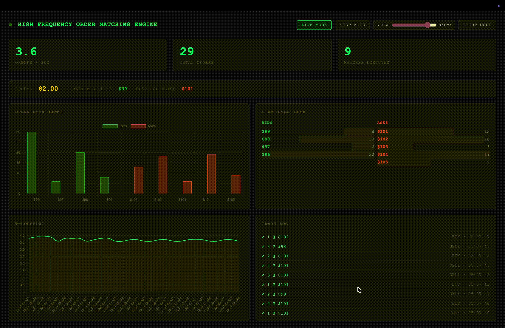

# Limit Order Book Engine

A low-latency order matching engine built in C++ with a Python/FastAPI dashboard for live visualization.  
This project now runs as a two-container stack (matching engine + dashboard) and is deployed on AWS EC2 using Docker Compose.



## What's New

- Containerized backend and dashboard using separate Docker Files
- Multi-service orchestration with Docker Compose
- AWS EC2 deployment workflow
- Browser dashboard served from FastAPI with live WebSocket updates

## Features

- **Fast C++ Matching Engine** - Efficient limit order book and matching logic
- **Price-Time Priority** - Best price first, FIFO within each price level
- **TCP Engine Service** - C++ engine listening on `8080`
- **FastAPI Dashboard Service** - Web UI and WebSocket stream on `8000`
- **Containerized Deployment** - One-command startup via Docker Compose

## Architecture

### Services

- **matching-engine** (`Dockerfile.cpp`)  
  Compiles and runs the C++ engine (`main.cpp`, `OrderBook.cpp`) on port `8080`.
- **dashboard** (`Dockerfile.python`)  
  Runs `client_vis.py` with FastAPI/Uvicorn on port `8000`.

`docker-compose.yml` connects both services on an internal Docker network and sets:
- `ENGINE_HOST=matching-engine` so the dashboard can send orders to the engine container.

### Matching Model

- **Bids (buy orders):** sorted high to low
- **Asks (sell orders):** sorted low to high
- A trade occurs when bid price >= ask price, executed according to the engine rules.

## Quick Start (Docker Compose)

### 1. Clone and enter the project

```bash
git clone <your-repo-url>
cd high_frequency_order_matching
```

### 2. Build and start both services

```bash
docker compose up --build
```

### 3. Open the dashboard

- Local: `http://localhost:8000`
- EC2: `http://<EC2_PUBLIC_IP>:8000`

### 4. Stop services

```bash
docker compose down
```

## AWS EC2 Deployment

### EC2 setup (one-time)

1. Launch an Ubuntu EC2 instance.
2. In the EC2 security group, allow inbound:
   - `22` (SSH) from your IP
   - `8000` (dashboard) from your desired source
   - `8080` (engine, optional external access; not required for dashboard use)
3. SSH into the instance.

### Install Docker + Compose plugin

```bash
sudo apt update
sudo apt install -y docker.io docker-compose-plugin git
sudo systemctl enable docker
sudo systemctl start docker
sudo usermod -aG docker $USER
newgrp docker
```

### Deploy app

```bash
git clone <your-repo-url>
cd high_frequency_order_matching
docker compose up -d --build
```

### Verify

```bash
docker compose ps
docker compose logs -f
```

Then open: `http://<EC2_PUBLIC_IP>:8000`

## Local Non-Docker Run (Optional)

If you want to run directly without containers:

```bash
g++ -std=c++11 main.cpp OrderBook.cpp -o matching-engine
./matching-engine
```

In another terminal:

```bash
pip install fastapi uvicorn websockets
python3 client_vis.py
```

Open `http://127.0.0.1:8000`.

## Order Protocol

Orders are sent over TCP as:

```text
<TYPE> <PRICE> <QUANTITY>
```

Examples:
- `B 100 5` (Buy 5 at 100)
- `S 102 10` (Sell 10 at 102)

## Project Structure

```text
high_frequency_order_matching/
├── Order.h
├── OrderBook.h
├── OrderBook.cpp
├── main.cpp
├── client.py
├── client_vis.py
├── dashboard.html
├── Dockerfile.cpp
├── Dockerfile.python
├── docker-compose.yml
└── README.md
```

## Troubleshooting

- If Docker permission errors appear on EC2, re-login after adding your user to the `docker` group.
- If dashboard does not load, check that port `8000` is open in security groups and not blocked by instance firewall.
- If containers fail to start, inspect logs:

```bash
docker compose logs matching-engine
docker compose logs dashboard
```

## License

This project is open source and available for educational purposes.

