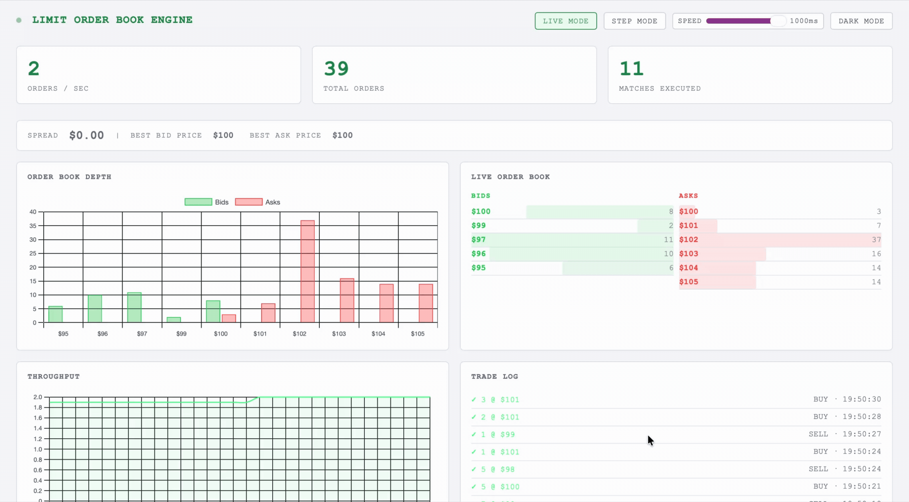

# Limit Order Book Engine

A low-latency order matching engine built in C++ with a Python/FastAPI dashboard for live visualization.  
This project now runs as a two-container stack (matching engine + dashboard) and is deployed on AWS EC2 using Docker Compose.



## What's New

- Containerized backend and dashboard using separate Docker Files
- Multi-service orchestration with Docker Compose
- AWS EC2 deployment workflow
- Browser dashboard served from FastAPI with live WebSocket updates

## Motivation 
I built this project to better understand how high frequency trading works, to build OrderBook objects in C++ using OOP, and build low latency socket servers 
and optimized data structures like red-black trees in C++.

## Performance 
- Constant throughput (1850 orders/sec) as load scaled 10x from 10K to 100K orders.
- Sub ms latency (0.52-0.54 ms) for each order.

## Features

- **Fast C++ Matching Engine** - Efficient limit order book and matching logic
- **Price-Time Priority** - Best price first, FIFO within each price level
- **Live-Order-Matching Mode** - Displays live order matching process, showing live throughput and number of orders processed. 
- **Instructional Step Mode** - Shows each step in the order matching process. This can be used to learn about how mock trades executed and orders are matched based on price-time-priority. 


- **TCP Engine Service** - Routes real time flow between C++ engine listening on `8080` and the frontend. 
- **FastAPI Dashboard Service** - Web UI and WebSocket stream on `8000`
- **Containerized Deployment** - One-command startup via Docker Compose
- **Light/Dark Mode** - Users can choose light/dark mode depending on preferences. 

### Matching Model

- **Bids (buy orders):** sorted high to low
- **Asks (sell orders):** sorted low to high
- A trade occurs when bid price >= ask price, executed according to the engine rules.

## Architecture Overview

```text
User -> Python FastAPI Dashboard -> TCP order messages -> C++ Matching Engine -> Browser over WebSocket
```

- The dashboard generates orders, forwards them to the C++ engine over TCP, and renders the live book state and trade updates in the browser over WebSocket.
- The engine owns the matching logic and price-time priority rules.
- The Python service is responsible for orchestration, state display, and user interaction.

## Usage

- **matching-engine** (`Dockerfile.cpp`)  
  Compiles and runs the C++ engine (`main.cpp`, `OrderBook.cpp`) on port `8080`.
- **dashboard** (`Dockerfile.python`)  
  Runs `client_vis.py` with FastAPI/Uvicorn on port `8000`.

`docker-compose.yml` connects both services on an internal Docker network and sets:
- `ENGINE_HOST=matching-engine` so the dashboard can send orders to the engine container.


## Quick Start (Docker Compose)

### 1. Clone and enter the project

```bash
git clone git@github.com:ashram15/limit-order-book-engine.git
cd limit-order-book-engine
```

### 2. Build and start both services

```bash
docker compose up --build
```

### 3. Open the dashboard

- Local: `http://localhost:8000`
- EC2: `http://<EC2_PUBLIC_IP>:8000`

### 4. Stop services

```bash
docker compose down
```

<!-- ## AWS EC2 Deployment

### EC2 setup (one-time)

1. Launch an Ubuntu EC2 instance.
2. In the EC2 security group, allow inbound:
   - `22` (SSH) from your IP
   - `8000` (dashboard) from your desired source
   - `8080` (engine, optional external access; not required for dashboard use)
3. SSH into the instance.

### Install Docker + Compose plugin

```bash
sudo apt update
sudo apt install -y docker.io docker-compose-plugin git
sudo systemctl enable docker
sudo systemctl start docker
sudo usermod -aG docker $USER
newgrp docker
```

### Deploy app

```bash
git clone <your-repo-url>
cd high_frequency_order_matching
docker compose up -d --build
```

### Verify

```bash
docker compose ps
docker compose logs -f
```

Then open: `http://<EC2_PUBLIC_IP>:8000` -->

## Local Non-Docker Run 

If you want to run directly without containers:

```bash
g++ -std=c++11 main.cpp OrderBook.cpp -o matching-engine
./matching-engine
```

In another terminal:

```bash
pip install fastapi uvicorn websockets
python3 client_vis.py
```

Open `http://127.0.0.1:8000`.

## One-Shot Throughput Benchmark

This project does not have a built-in server-side TPS counter, so the practical way to measure throughput is to run a synthetic client against the live engine and time end-to-end request handling.

Start the C++ engine, then run:

```bash
python3 benchmark.py --orders 10000 --warmup 500
```

For a match-heavy workload, add `--crosses`:

```bash
python3 benchmark.py --orders 10000 --warmup 500 --crosses
```

The script reports measured orders/sec and average latency per order. Because this engine handles one TCP connection per order on a single accept loop, the number is best treated as an end-to-end benchmark for this exact deployment.

## Order Protocol

Orders are sent over TCP as:

```text
<TYPE> <PRICE> <QUANTITY>
```

Examples:
- `B 100 5` (Buy 5 at 100)
- `S 102 10` (Sell 10 at 102)

## Project Structure

```text
high_frequency_order_matching/
├── Order.h
├── OrderBook.h
├── OrderBook.cpp
├── main.cpp
├── client.py
├── client_vis.py
├── dashboard.html
├── Dockerfile.cpp
├── Dockerfile.python
├── docker-compose.yml
└── README.md
```
